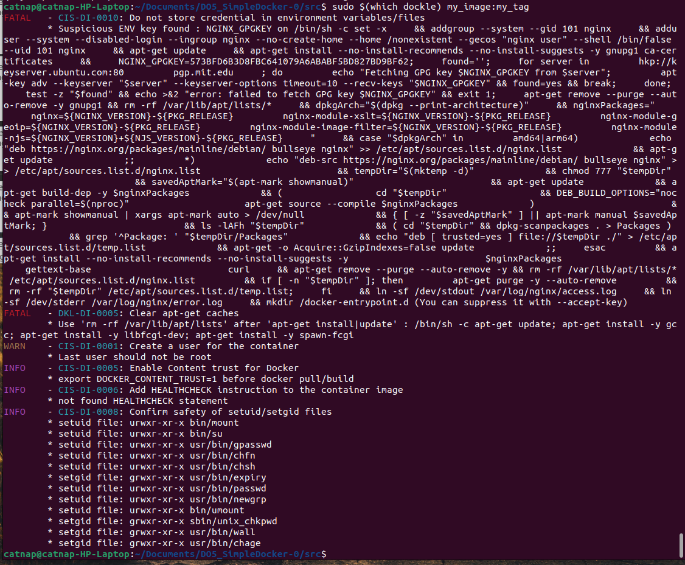

## Part 1. Готовый докер

1. Загрузка официального докер образа nginx через `docker pull`;
2. Отображение списка доступных образов через `docker images`;
3. Запуск контейнера из образа через `docker run`;
4. Проверка того, что контейнер запущен и работает, через `docker ps`.

Вывод информации об образе через `docker inspect`:

\- размер контейнера:  
`"ShmSize": 67108864`  
\- список замапленных портов:  
`"ExposedPorts": {
                "80/tcp": {}
            }`  
\- ip контейнера:  
`"IPAddress": "172.17.0.2"`

Остановка докера командой `docker stop` и проверка того, что запущенных контейнеров нет:

Запуск контейенра с замапленными портами 80 и 443 на локальную машину командой `sudo docker run -d -p 80:80 -p 443:443 nginx`:

Видим стартовую страничку nginx'а на локальной машине по адресу localhost:80.

Перезапуск контейнера через `docker restart`:

## Part 2. Операции с контейнером

Прочитанный nginx.conf командой `docker exec`:

Измененный nginx.conf для того, чтобы по адресу localhost:80/status отдавать статус сервера nginx:

Копирование конфига в контейнер с помощью `docker cp` и перезапуск nginx:

Страница localhost:80/status.

Экспорт контейнера - `docker export`, остановка контейнера - `docker stop` и удаление образа - `docker rmi`. Страница стала недоступна после остановки контейнера.

Импорт контейнера из ранее созданного архива - `docker import` и его запуск.

Страница localhost:80/status снова заработала.

## Part 3. Мини веб-сервер

Код программы на C с использованием FastCgi:

Скрипт для компиляции программы и запуска сервера на порту 8080:

Переделанный nginx.conf, который теперь передает все запросы к 81 порту на 127.0.0.1:8080:

Страница на локальной машине по адресу localhost:81.

## Part 4. Свой докер

Базовый докерфайл:

    FROM — задаёт базовый (родительский) образ.
    LABEL — описывает метаданные. Например — сведения о том, кто создал и поддерживает образ.
    ENV — устанавливает постоянные переменные среды.
    RUN — выполняет команду и создаёт слой образа. Используется для установки в контейнер пакетов.
    COPY — копирует в контейнер файлы и папки.
    ADD — копирует файлы и папки в контейнер, может распаковывать локальные .tar-файлы.
    CMD — описывает команду с аргументами, которую нужно выполнить когда контейнер будет запущен. Аргументы могут быть переопределены при запуске контейнера. В файле может присутствовать лишь одна инструкция CMD.
    WORKDIR — задаёт рабочую директорию для следующей инструкции.
    ARG — задаёт переменные для передачи Docker во время сборки образа.
    ENTRYPOINT — предоставляет команду с аргументами для вызова во время выполнения контейнера. Аргументы не переопределяются.
    EXPOSE — указывает на необходимость открыть порт.
    VOLUME — создаёт точку монтирования для работы с постоянным хранилищем.

Сборка докера из Dockerfile:

`sudo docker build -t my_image:tag .`

После сборки проверяем наличие образа, а затем запускаем его с маппингом 81 порта на 80 на локальной машине и маппингом папки ./nginx внутрь контейнера по адресу, где лежат конфигурационные файлы nginx'а:

`sudo docker run -dit -p 80:81 -v ~/Documents/DO5_SimpleDocker-0/src/nginx/nginx.conf:/etc/nginx/nginx.conf --name container my_image:my_tag`

Веб-странички после добавления проксирования /status:

## Part 5. Dockle

Вывод Dockle до исправления:

Исправленный Dockerfile:

Вывод Dockle после исправления:

FATAL WARN больше нет.

## Part 6. Базовый Docker Compose

Dockerfile для своего контейнера:

Docker-compose:

nginx.conf для nginx-контейнера:

nginx.conf для своего контейнера:

Сборка с помощью `docker-compose build` и `docker-compose up -d`:

Страница по адресу localhost:80

